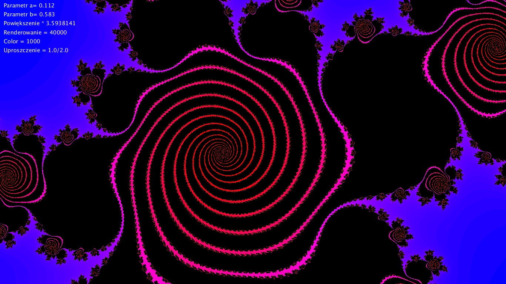
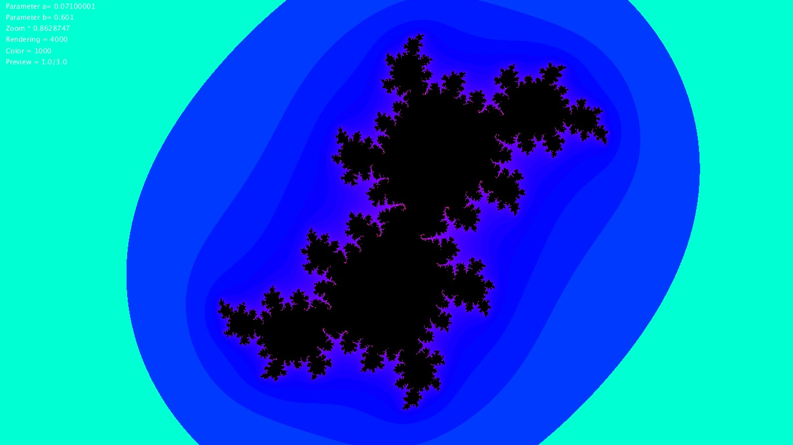
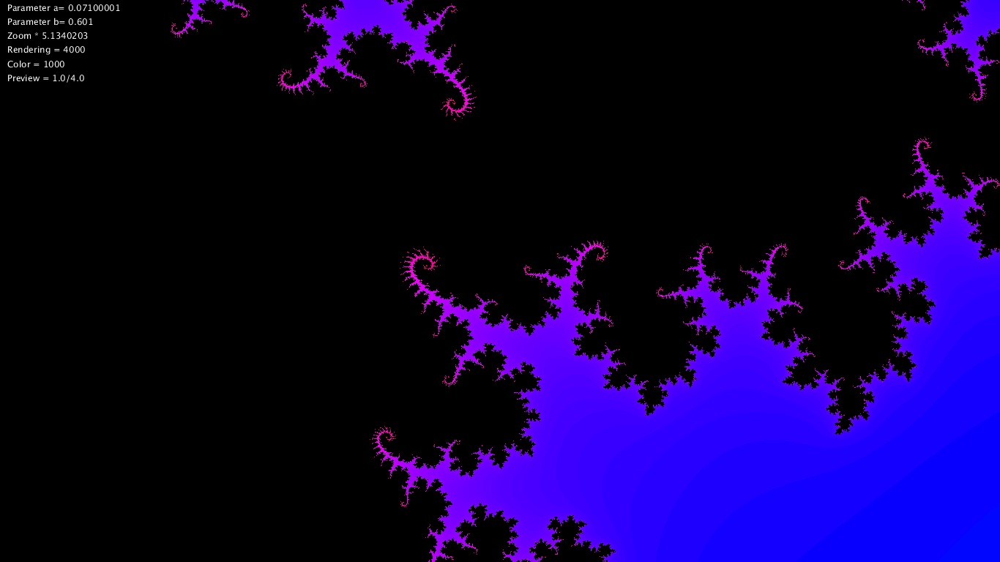
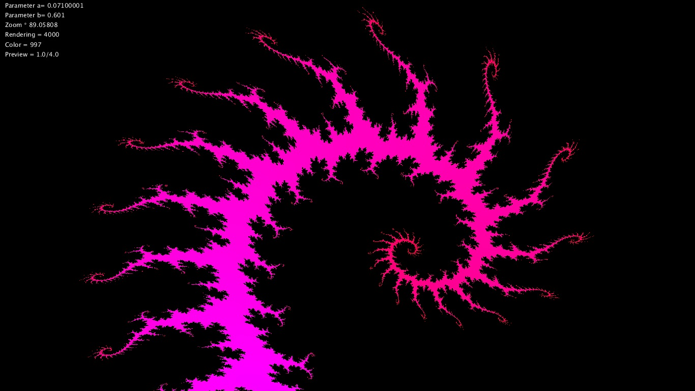
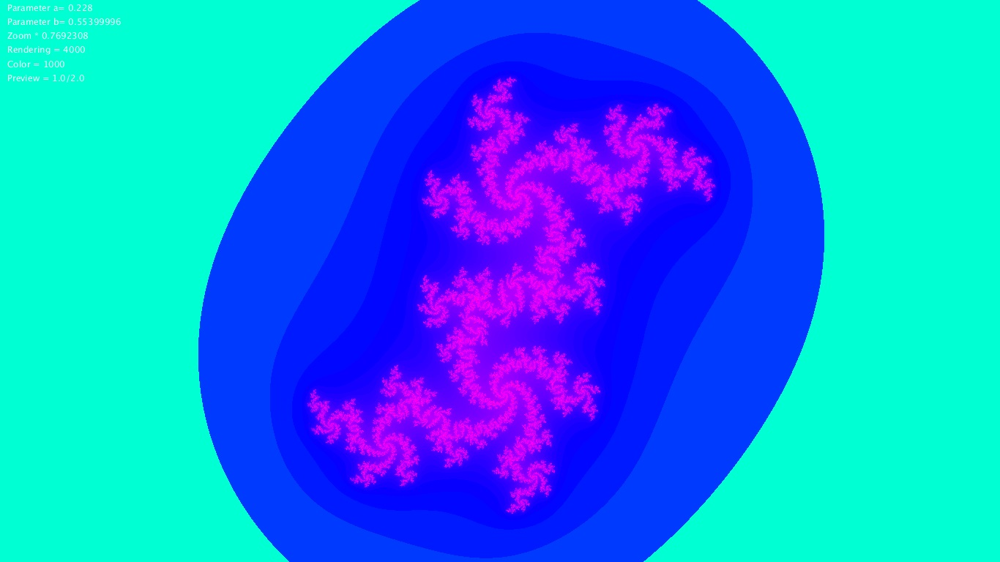

# Julia_Set
Program napisany w Javie w środowisku graficznym Processing.  
Aby go skompilować wymagane jest środowisko.  
  
Program jest implementacją jednego z najbardziej znanych  
fraktli: zbioru Julii. Jest to zmodyfikowany mój inny program  
generujący zbiór Mandelbrota, jako że wzór matematyczny tych dwóch  
zbiorów jest bardzo podobny.  
  
Więcej o Zbiorze Julii:  
https://pl.wikipedia.org/wiki/Zbiór_Julii  
  
Poza podstawowym działaniem program posiada parę funkcji 
dostępnych z poziomu klawiatury:  
- ZMIANA PARAMETRÓW ZBIORU (a/d - część rzeczywista A ; s/w - część urojona B)  
- zmiana dokładności próbkowania (GÓRA/DÓŁ)
- tryb podglądu (SPACJA - on/off ; -/+ - zmiana dokładności podglądu)
- printScreen (ENTER)
- zmiana skalowania kolorów ( [ / ] )  
  
Na ekranie widoczny jest podgląd powyższych parametrów.  
  
Uwagi dot. używania programu:  
- Czasami program się wiesza, i trzeba zamknąć okno alt+F4. (można go tak zawsze zamykać)  
- z poziomu klawiatury parametry można zmieniać tylko co 0.001,  
 dlatego jeżeli urzytkownik chce ustawić jakieś konkretne wartości,  
 warto to zrobić w programie przed skompilowaniem.  
  
Wersja z dopiskiem "pix" to ten sam program, działający  
jednak na wbudowaniej w Processinga tablicy pixels[], co  
przyspiesza działanie programu. Ta wersja może mieć błędy,  
ponieważ była mniej testowana.
  
  
Przykładowe kadry z programu:  
c=0.112 + 0.583i  
  
c=0.71 + 0.601i  

  
  
c=0.228 + 0.554i  
  
